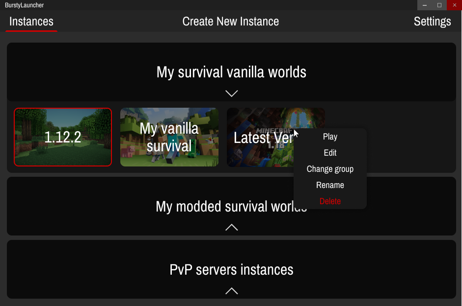

# Bursty Launcher - Minecraft Launcher
### What's BurstyLauncher 🤔?
Bursty Launcher will allow you to create different instances for each version of Minecraft. This allows you to stay organized without touching the game folder to change something. It is compatible with Curseforge and the various modding APIs (Fabric, Forge) which allows you to create a Forge instance with a few clicks.
### Why use BurstyLauncher 🎮?
Bursty Launcher is similar to the famous MultiMC launcher. On the other hand, the interface of BurstyLauncher is made to be more intuitive and modern.
### Features 🚀
- [ ] Automatic downloader (Java, Minecraft, Forge, Fabric)
- [ ] Install mods easily with Curseforge
- [ ] Multi-Account management (connect with Microsoft account)
- [ ] Automatic updates
- [ ] Search for an instance easily
- [ ] Create multiple instances
- [ ] Change the accent color of the interface
- Lot of futures features 👀...
### Design concepts ✏️
#### Gestion des instances

These are prototypes, not finished renderings. These concepts are subject to change during development.
